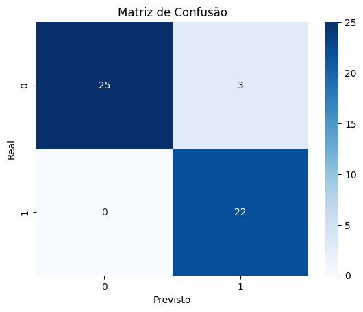
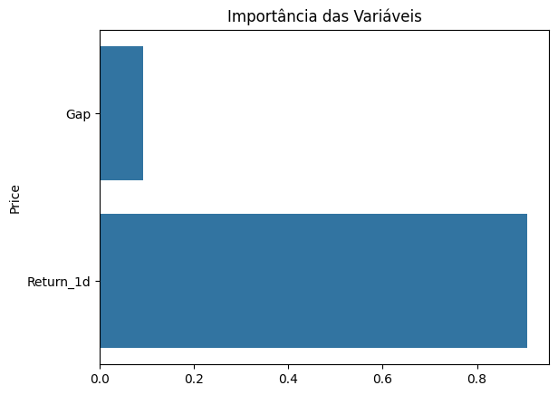

# Projeto GAP Prediction

A estratégia GAP é a diferença significativa entre o preço de fechamento de um dia e o preço de abertura do dia seguinte. Essa estratégia explora a hipótese que os agentes que atuam no mercado financeiro tenderá a corrigir essa diferença ao longo do pregão, "fechando o gap".

## Objetivo do projeto

Desenvolver um modelo de Machine Learning (ML) capaz de prever quando o GAP será fechado.

## Fundamentação teórica

O comportamento esperado de retorno do preço ao nível anterior se alinha mais fortemente à Teoria da Reversão à Média (Mean Reversion), muito utilizada em finanças quantitativas e séries temporais. Em outras palavras, o preço de um ativo tende a retornar à sua média histórica ao longo do tempo. Neste cenário, os movimentos bruscos nos valores do ativos são vistos como ruído e não refletem o seu valor real. Assim, o valor real possui uma estabilidade estatística e para que compreender esse cenários são utilizados indicadores, tais como:
 - Média móvel (SMA, EMA);
 - Bollinger Bands;
 - RSI (Índice de Força Relativa);

Os modelos comumente relacionados são:
 - AR (Auto-Regressive);
 - ARMA, ARIMA;
 - Ornstein-Uhlenbeck (modelo estocástico clássico para mean reversion).

Além da estratégia de fechamento de GAP, tem-se as estratégias de Pairs trading e Bollinger Band Reversal.

### Descrição
Este projeto aplica técnicas de Machine Learning para prever se um GAP (diferença entre fechamento e abertura do dia seguinte)
será fechado no mesmo pregão. Baseado em conceitos de ***Mean Reversion*** e indicadores técnicos.

---

## Estrutura do Projeto
```
gap-ml-project/
│
├── data/                  # Dados brutos ou processados (sem dados sensíveis)
├── notebooks/             # Notebooks com código e análises
├── scripts/               # Scripts organizados para reuso
├── visuals/               # Gráficos e imagens geradas
├── README.md              # Documentação (este arquivo)
├── requirements.txt       # Dependências Python
└── LICENSE                # Licença do projeto
```

---

## Instalação
```bash
git clone https://github.com/osvaldojeronymo/gap-ml-project.git
cd gap-ml-project
pip install -r requirements.txt
```

---

## Pipeline
1. **Coleta de dados** via `yfinance`
2. **Pré-processamento**: cálculo do GAP, indicadores técnicos
3. **Modelagem**: `RandomForestClassifier` como baseline
4. **Avaliação**: matriz de confusão, métricas de classificação

---

## Resultados e Visualizações
### GAP ao longo do tempo


### Matriz de Confusão


### Importância das Variáveis


---

## Referências
- Marcos López de Prado – *Advances in Financial Machine Learning*
- Investopedia – *Gap Trading Strategies*

---

## 📜 Licença
Este projeto está licenciado sob a Licença MIT. Consulte o arquivo LICENSE para mais detalhes.